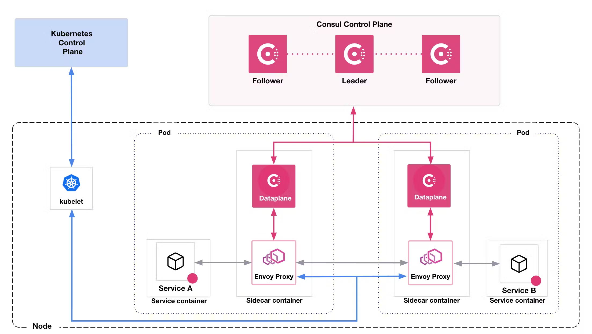
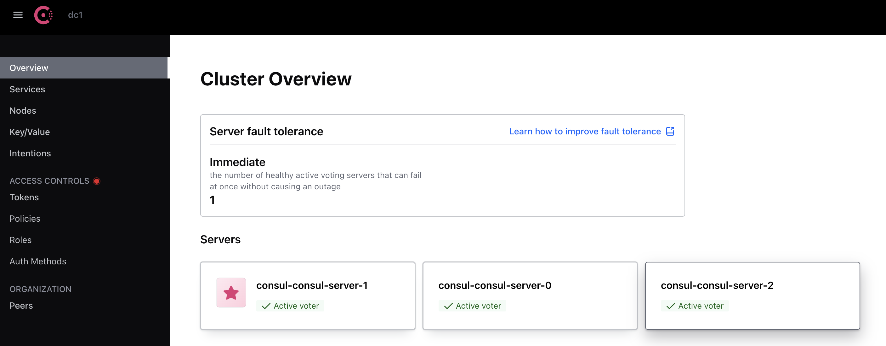

# Consul

> https://www.consul.io/

## Consul on Kubernetes

> https://developer.hashicorp.com/consul/docs/k8s

### Architecture



[참고] [Consul - Kuberentes - Architecture](https://developer.hashicorp.com/consul/docs/k8s/architecture)

## Installation

### Add Helm Repositories

```bash
# add charts repo
# download charts
~ % ./00.helm_add_repo.sh
```

### config values.yaml

```yaml
server:
  enabled: true
  ...
  #replicas: 5
...
client:
  enabled: true
...
ui:
  enabled: true
  service:
    ...
    type: NodePort
...
connectInject:
  replicas: 5
```

### Install using helm

```bash
~ % ./01.install_using_helm.sh
+ VERSION=1.2.0
+ helm upgrade --install consul ./assets/consul -f ./examples/values.yaml -n consul --create-namespace --version 1.2.0
Release "consul" does not exist. Installing it now.
NAME: consul
LAST DEPLOYED: Fri Sep  1 13:52:42 2023
NAMESPACE: consul
STATUS: deployed
REVISION: 1
NOTES:
Thank you for installing HashiCorp Consul!

Your release is named consul.

To learn more about the release, run:

  $ helm status consul --namespace consul
  $ helm get all consul --namespace consul

Consul on Kubernetes Documentation:
https://www.consul.io/docs/platform/k8s

Consul on Kubernetes CLI Reference:
https://www.consul.io/docs/k8s/k8s-cli
```

```bash
~ % k get all -n consul
NAME                                                      READY   STATUS    RESTARTS   AGE
pod/consul-consul-client-6p999                            1/1     Running   0          3m5s
pod/consul-consul-client-nf22v                            1/1     Running   0          3m5s
pod/consul-consul-client-s5dl2                            1/1     Running   0          3m5s
pod/consul-consul-client-tdwnj                            1/1     Running   0          3m5s
pod/consul-consul-client-x9l89                            1/1     Running   0          3m5s
pod/consul-consul-connect-injector-67bdddb5fd-9jd2x       1/1     Running   0          3m5s
pod/consul-consul-server-0                                1/1     Running   0          3m1s
pod/consul-consul-server-1                                1/1     Running   0          3m
pod/consul-consul-server-2                                1/1     Running   0          2m58s
pod/consul-consul-webhook-cert-manager-6c4676cd4b-8qq57   1/1     Running   0          3m5s

NAME                                     TYPE        CLUSTER-IP     EXTERNAL-IP   PORT(S)                                                                            AGE
service/consul-consul-connect-injector   ClusterIP   10.96.15.79    <none>        443/TCP                                                                            3m6s
service/consul-consul-dns                ClusterIP   10.96.12.151   <none>        53/TCP,53/UDP                                                                      3m6s
service/consul-consul-server             ClusterIP   None           <none>        8500/TCP,8502/TCP,8301/TCP,8301/UDP,8302/TCP,8302/UDP,8300/TCP,8600/TCP,8600/UDP   3m6s
service/consul-consul-ui                 NodePort    10.96.5.15     <none>        80:31008/TCP                                                                       3m6s

NAME                                  DESIRED   CURRENT   READY   UP-TO-DATE   AVAILABLE   NODE SELECTOR   AGE
daemonset.apps/consul-consul-client   5         5         5       5            5           <none>          3m7s

NAME                                                 READY   UP-TO-DATE   AVAILABLE   AGE
deployment.apps/consul-consul-connect-injector       1/1     1            1           3m7s
deployment.apps/consul-consul-webhook-cert-manager   1/1     1            1           3m7s

NAME                                                            DESIRED   CURRENT   READY   AGE
replicaset.apps/consul-consul-connect-injector-67bdddb5fd       1         1         1       3m7s
replicaset.apps/consul-consul-webhook-cert-manager-6c4676cd4b   1         1         1       3m7s

NAME                                    READY   AGE
statefulset.apps/consul-consul-server   3/3     3m6s
```

## UI

`${NODE_IP}:${NODE_PORT}`


