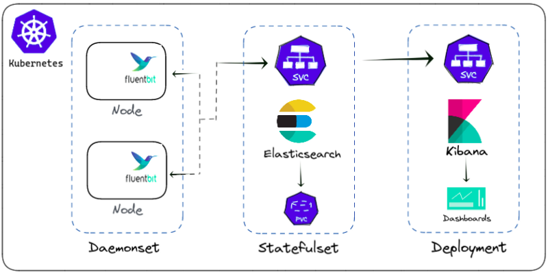

# EFK

- Elasticsearch: 대량의 로그를 저장하고 검색

    > https://www.elastic.co/kr/elasticsearch/

- Fluent Bit: 로그 및 메트릭 수집 및 전달

    > https://fluentbit.io/

- Kibana: 데이터 시각화, 쿼리 및 대시보드를 위한 그래픽 사용자 인터페이스(GUI) 도구

    > https://www.elastic.co/kr/kibana/

## Flow



[참고] [Protected EFK Stack Setup for Kubernetes](https://blog.opstree.com/2023/01/24/protected-efk-stack-setup-for-kubernetes/)

## Elasticsearch 

- 라이선스 문제로 인하여, Apache 2.0 License 인 `7.10.2` 버전으로 설치한다.

    > https://www.elastic.co/kr/pricing/faq/licensing

- 설치 시 `PodDisruptionBudget`의 apiVersion 오류로 인해 `apiVersion`을 `policy/v1`로 변경하여 배포한다. 

    ```yaml
    # templates/poddisruptionbudget.yaml
    
    apiVersion: policy/v1
    kind: PodDisruptionBudget
    ...
    ```

- Elasticsearch와 kibana의 버전은 같아야 한다.


## Installation

### Add Helm Repositories

```bash
# add charts repo
# download charts
~ % ./00.helm_add_repo.sh
```

### config values.yaml

```yaml
  ## fluentbit_values.yaml
  ...
  outputs: |
    [OUTPUT]
        Name es
        Match kube.*
        Host elasticsearch-master
        Logstash_Format On
        Retry_Limit False
        Replace_Dots On
```

### Install using helm

```bash
# create kubernetes namespace 
# install using helm
~ % ./01.install_using_helm.sh

## output
namespace/efk created

NAME: elasticsearch
LAST DEPLOYED: Tue Jul 25 09:56:30 2023
NAMESPACE: efk
STATUS: deployed
REVISION: 1
NOTES:
1. Watch all cluster members come up.
  $ kubectl get pods --namespace=efk -l app=elasticsearch-master -w
2. Test cluster health using Helm test.
  $ helm test elasticsearch
  
NAME: kibana
LAST DEPLOYED: Tue Jul 25 09:56:31 2023
NAMESPACE: efk
STATUS: deployed
REVISION: 1
TEST SUITE: None

NAME: fluent-bit
LAST DEPLOYED: Tue Jul 25 09:56:31 2023
NAMESPACE: efk
STATUS: deployed
REVISION: 1
NOTES:
Get Fluent Bit build information by running these commands:

export POD_NAME=$(kubectl get pods --namespace efk -l "app.kubernetes.io/name=fluent-bit,app.kubernetes.io/instance=fluent-bit" -o jsonpath="{.items[0].metadata.name}")
kubectl --namespace efk port-forward $POD_NAME 2020:2020
curl http://127.0.0.1:2020
```

## Kibana

```bash
~ % kubectl port-forward -n elastic svc/kibana-kibana 5601
```

### Dashboard

> localhost:5601

- Create Index Pattern

    - Management > Stack Management > Index Patterns > Create Index Pattern > `logstash-*`

- Kibana > Discover
