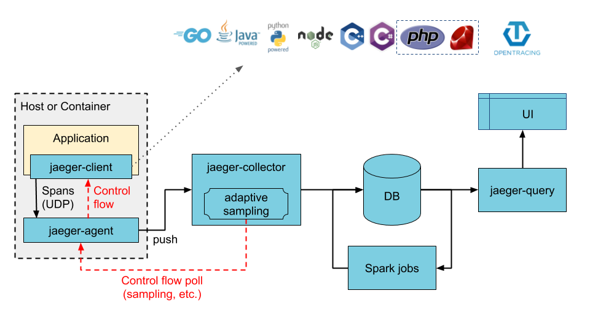
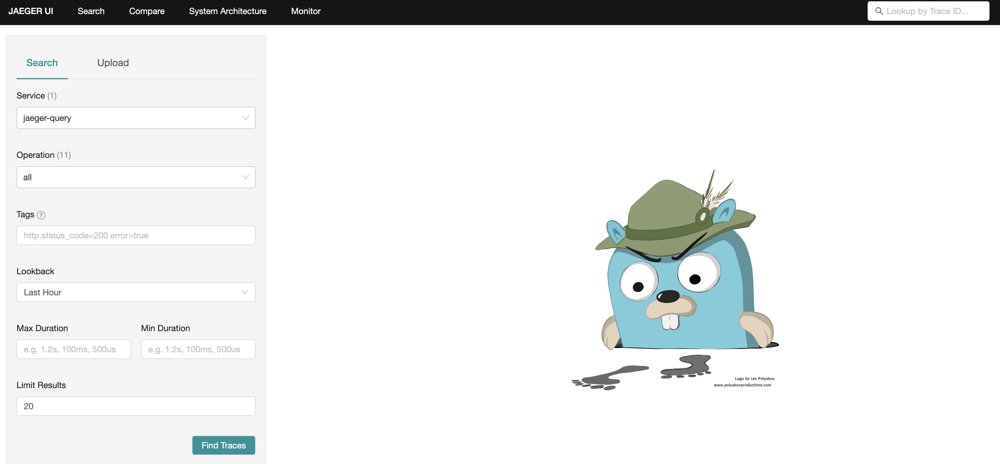

# Jaeger

> https://www.jaegertracing.io/


## Jaeger Helm Charts

> https://github.com/jaegertracing/helm-charts




- query: jaeger에 수집된 데이터를 시각화해주는 Web UI 서버

- collector: 실제로 데이터가 수집되는 jaeger 핵심 서버

- agent: envoy, flask, spring 등과 같은 데이터 소스가 데이터를 전송하기 위한 중간 서버


## Installation

### Add Helm Repositories

```bash
# add charts repo
# download charts
~ % ./00.helm_add_repo.sh
```

### config values.yaml

```yaml
provisionDataStore:
  cassandra: false
...
storage:
  # allowed values (cassandra, elasticsearch)
  type: elasticsearch
  ...
  elasticsearch:
    host: elasticsearch-master.efk
    password: "1234"
...
query:
  service:
    type: NodePort
    nodePort: 32500
```

### Install using helm

```bash
# install using helm
~ % ./01.install_using_helm.sh
```

```bash
~ % k get all -n jaeger
NAME                                    READY   STATUS    RESTARTS   AGE
pod/jaeger-agent-4vhdm                  1/1     Running   0          11d
pod/jaeger-agent-cl9q2                  1/1     Running   0          11d
pod/jaeger-agent-gbqs5                  1/1     Running   0          11d
pod/jaeger-agent-jmq8p                  1/1     Running   0          11d
pod/jaeger-agent-lst89                  1/1     Running   0          11d
pod/jaeger-collector-64487f96c5-6q4gx   1/1     Running   0          10d
pod/jaeger-query-db6d87889-wk97s        2/2     Running   0          10d

NAME                       TYPE        CLUSTER-IP    EXTERNAL-IP   PORT(S)                                         AGE
service/jaeger-agent       ClusterIP   10.96.11.44   <none>        5775/UDP,6831/UDP,6832/UDP,5778/TCP,14271/TCP   11d
service/jaeger-collector   ClusterIP   10.96.2.96    <none>        14250/TCP,14268/TCP,14269/TCP                   11d
service/jaeger-query       NodePort    10.96.7.228   <none>        80:32500/TCP,16685:31201/TCP,16687:31888/TCP    11d

NAME                          DESIRED   CURRENT   READY   UP-TO-DATE   AVAILABLE   NODE SELECTOR   AGE
daemonset.apps/jaeger-agent   5         5         5       5            5           <none>          11d

NAME                               READY   UP-TO-DATE   AVAILABLE   AGE
deployment.apps/jaeger-collector   1/1     1            1           11d
deployment.apps/jaeger-query       1/1     1            1           11d

NAME                                          DESIRED   CURRENT   READY   AGE
replicaset.apps/jaeger-collector-64487f96c5   1         1         1       10d
replicaset.apps/jaeger-collector-848bc979fc   0         0         0       11d
replicaset.apps/jaeger-query-594c699bdc       0         0         0       11d
replicaset.apps/jaeger-query-db6d87889        1         1         1       10d
```

## UI

`${NODE_IP}:${NODE_PORT}`


