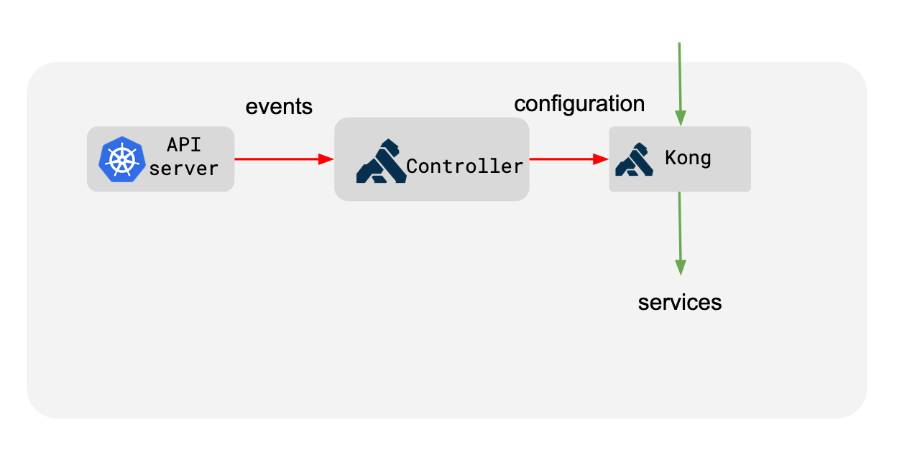

# Kong

## Kong for Kubernetes

> Kong for Kubernetes is an open-source Ingress Controller for Kubernetes
>
> https://github.com/Kong/charts/blob/main/charts/kong/README.md


### Kong Ingress Controller Design




## Installation

### Add Helm Repositories

```bash
# add charts repo
# download charts
~ % ./00.helm_add_repo.sh
```

### config values.yaml

```yaml
# Specify Kong proxy service configuration
proxy:
  # Enable creating a Kubernetes service for the proxy
  enabled: true
  type: NodePort
```

### Create an Istio-enabled namespace for Kong Ingress Controller

```bash
kubectl create namespace kong

kubectl label namespace kong istio-injection=enabled
```

### Intall using helm

```bash
~ % ./01.install_using_helm.sh
+ VERSION=2.26.4
+ helm upgrade --install kong ./assets/kong -f ./examples/values.yaml -n kong --create-namespace --version 2.26.4 --set ingressController.installCRDs=false
Release "kong" does not exist. Installing it now.
NAME: kong
LAST DEPLOYED: Mon Aug 28 14:46:48 2023
NAMESPACE: kong
STATUS: deployed
REVISION: 1
TEST SUITE: None
NOTES:
To connect to Kong, please execute the following commands:
HOST=$(kubectl get nodes --namespace kong -o jsonpath='{.items[0].status.addresses[0].address}')
PORT=$(kubectl get svc --namespace kong kong-kong-proxy -o jsonpath='{.spec.ports[0].nodePort}')
export PROXY_IP=${HOST}:${PORT}
curl $PROXY_IP

Once installed, please follow along the getting started guide to start using
Kong: https://docs.konghq.com/kubernetes-ingress-controller/latest/guides/getting-started/
```

```bash
~ % k get all -n kong
NAME                             READY   STATUS    RESTARTS   AGE
pod/kong-kong-598f94b9ff-4dn47   2/2     Running   0          55s

NAME                                   TYPE        CLUSTER-IP     EXTERNAL-IP   PORT(S)                         AGE
service/kong-kong-manager              NodePort    10.96.15.143   <none>        8002:31073/TCP,8445:32572/TCP   55s
service/kong-kong-proxy                NodePort    10.96.8.105    <none>        80:31432/TCP,443:32397/TCP      55s
service/kong-kong-validation-webhook   ClusterIP   10.96.15.57    <none>        443/TCP                         55s

NAME                        READY   UP-TO-DATE   AVAILABLE   AGE
deployment.apps/kong-kong   1/1     1            1           55s

NAME                                   DESIRED   CURRENT   READY   AGE
replicaset.apps/kong-kong-598f94b9ff   1         1         1       55s
```

### deploy bookinfo example application

```bash
# Create the namespace
~ % kubectl create namespace bookinfo
namespace/bookinfo created

# Label the namespace for Istio injection
~ $ kubectl label namespace bookinfo istio-injection=enabled
namespace/bookinfo labeled

# Deploy the BookInfo app from the Istio bundle
~ % kubectl apply -n bookinfo -f ./examples/bookinfo.yaml
service/details created
serviceaccount/bookinfo-details created
deployment.apps/details-v1 created
service/ratings created
serviceaccount/bookinfo-ratings created
deployment.apps/ratings-v1 created
service/reviews created
serviceaccount/bookinfo-reviews created
deployment.apps/reviews-v1 created
deployment.apps/reviews-v2 created
deployment.apps/reviews-v3 created
service/productpage created
serviceaccount/bookinfo-productpage created
deployment.apps/productpage-v1 created
```

```bash
~ % kubectl get all -n bookinfo
NAME                                  READY   STATUS    RESTARTS   AGE
pod/details-v1-6997d94bb9-vb6gr       2/2     Running   0          91s
pod/productpage-v1-58b4c9bff8-ph7rn   2/2     Running   0          90s
pod/ratings-v1-b8f8fcf49-wk6bb        2/2     Running   0          90s
pod/reviews-v1-5896f547f5-kcvlc       2/2     Running   0          90s
pod/reviews-v2-5d99885bc9-twr2g       2/2     Running   0          90s
pod/reviews-v3-589cb4d56c-dgqpb       2/2     Running   0          90s

NAME                  TYPE        CLUSTER-IP    EXTERNAL-IP   PORT(S)    AGE
service/details       ClusterIP   10.96.9.194   <none>        9080/TCP   92s
service/productpage   ClusterIP   10.96.9.37    <none>        9080/TCP   91s
service/ratings       ClusterIP   10.96.9.29    <none>        9080/TCP   92s
service/reviews       ClusterIP   10.96.9.205   <none>        9080/TCP   91s

NAME                             READY   UP-TO-DATE   AVAILABLE   AGE
deployment.apps/details-v1       1/1     1            1           92s
deployment.apps/productpage-v1   1/1     1            1           91s
deployment.apps/ratings-v1       1/1     1            1           91s
deployment.apps/reviews-v1       1/1     1            1           91s
deployment.apps/reviews-v2       1/1     1            1           91s
deployment.apps/reviews-v3       1/1     1            1           91s

NAME                                        DESIRED   CURRENT   READY   AGE
replicaset.apps/details-v1-6997d94bb9       1         1         1       92s
replicaset.apps/productpage-v1-58b4c9bff8   1         1         1       91s
replicaset.apps/ratings-v1-b8f8fcf49        1         1         1       91s
replicaset.apps/reviews-v1-5896f547f5       1         1         1       91s
replicaset.apps/reviews-v2-5d99885bc9       1         1         1       91s
replicaset.apps/reviews-v3-589cb4d56c       1         1         1       91s
```

### Access BookInfo externally through Kong Gateway

```bash
~ % kubectl apply -f ./examples/bookinfo-ingress.yaml
ingress.networking.k8s.io/productpage created

~ % curl -s -v 192.168.88.184:31432 | head -4
*   Trying 192.168.88.184:31432...
* Connected to 192.168.88.184 (192.168.88.184) port 31432 (#0)
> GET / HTTP/1.1
> Host: 192.168.88.184:31432
> User-Agent: curl/7.88.1
> Accept: */*
>
< HTTP/1.1 200 OK
< Content-Type: text/html; charset=utf-8
< Content-Length: 1683
< Connection: keep-alive
< server: envoy
< date: Mon, 28 Aug 2023 07:39:04 GMT
< x-envoy-upstream-service-time: 8
< X-Kong-Upstream-Latency: 12
< X-Kong-Proxy-Latency: 4
< Via: kong/3.3.1
<
{ [1683 bytes data]
* Connection #0 to host 192.168.88.184 left intact
<!DOCTYPE html>
<html>
  <head>
    <title>Simple Bookstore App</title>
```

```bash
$ COUNT=25 ; until [ $COUNT -le 0 ]; do curl -s -o /dev/null http://192.168.88.184:31432/productpage ; ((COUNT--)); done
```
