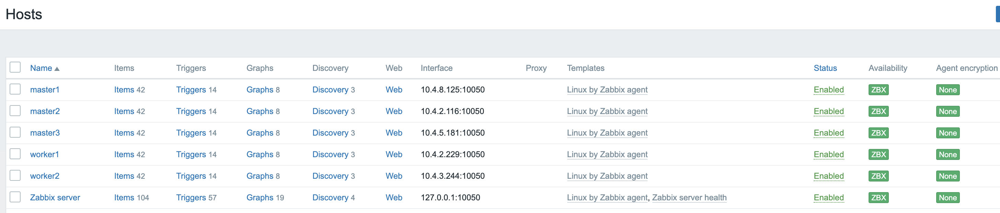
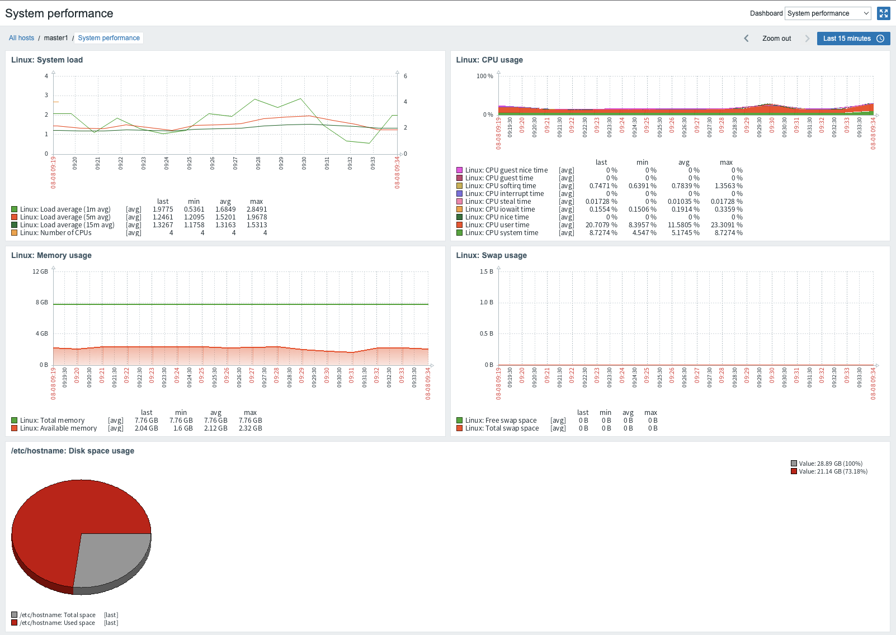

# Zabbix

> https://github.com/zabbix-community/helm-zabbix/

## zabbix components

### zabbix server

데이터 폴링 및 트래핑을 수행하고 트리거를 계산하고 사용자에게 알림을 보낸다. Zabbix 에이전트 및 프록시가 시스템의 가용성 및 무결성에 대한 데이터를 보고하는 중앙 구성 요소.

### zabbix agent

로컬 리소스 및 애플리케이션(하드드라이브, 메모리, 프로세서 통계 등)을 능동적으로 모니터링하기 위해 모니터링 대상에 배포.

운영 정보를 로컬에서 수집하고 데이터를 Zabbix Server에 보고한다. 

### zabbix web (frontend)

모니터링 중인 리소스를 관리하고 모니터링 통계를 보는 데 사용

### zabbix proxy (Optional)

하나 이상의 모니터링 장치에서 모니터링 데이터를 수집하고 기본적으로 서버를 대신하여 작동하는 Zabbix 서버에 정보를 보낼 수 있는 프로세스.

선택 사항이지만 단일 Zabbix 서버의 부하를 분산하는데 유용하며 별도의 데이터베이스가 필요하다.

### zabbix web service

외부 웹 서비스와의 통신에 사용되는 프로세스. 향후 추가 기능을 추가할 예정인 예약 보고서를 생성하고 전송하는 데 사용

### PostgreSQL

데이터가 저장되는 데이터베이스

## Installation

```bash
# Add Helm repo
helm repo add zabbix-community https://zabbix-community.github.io/helm-zabbix

# Update the list helm chart available for installation
helm repo update

# Get all versions of helm chart
helm search repo zabbix-community/zabbix -l

# Export default values of chart zabbix to file
helm show values zabbix-community/zabbix > ./examples/values.yaml

# Change the values according to the environment

# Test the installation/upgrade
helm upgrade --install zabbix zabbix-community/zabbix -f ./examples/zabbix_values.yaml -n monitoring --dry-run

# Install/upgrade the Zabbix
helm upgrade --install zabbix zabbix-community/zabbix -f ./examples/zabbix_values.yaml -n monitoring 

# View the pods
kubectl get pods -n monitoring
```

### config values.yaml

```yaml
# **Zabbix Agent** configurations
zabbixAgent:
  # -- Enables use of **Zabbix Agent**
  enabled: true
  ... 
  # -- Enable this mode if you want to run zabbix-agent as daemonSet. The 'zabbixAgent.runAsSidecar' option must be false.
  runAsDaemonSet: true
...  
# **Zabbix Web** configurations
zabbixWeb:
  # -- Enables use of **Zabbix Web**
  enabled: true
  ...  
  service:
    # -- Type of service for Zabbix Web
    type: NodePort
    ...
    # -- NodePort port to allocate (only if service.type = NodePort)
    nodePort: 31080
```

## Zabbix UI

### Login to zabbix

- URL: http://{{node_ip}}:31080

- Login: Admin

- Password: zabbix


### Configuration > Hosts

- Create Host

  - Interfaces > Agent 등록

  - Templates: Linux by Zabbix agent

  - Groups: Zabbix servers

  - 

### Monitoring > Hosts > System performance

- 

