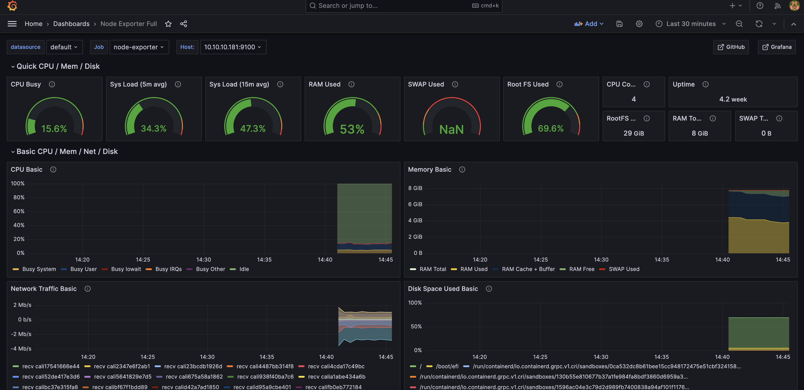

# prometheus + grafana

> https://github.com/prometheus-operator/kube-prometheus
>
> kube-prometheus-stack: https://github.com/prometheus-community/helm-charts/tree/main/charts/kube-prometheus-stack

## components

### alertmanager

Prometheus에서 수집된 경고 알림을 관리하고 전송하는 기능

### grafana

Grafana 서버. Promethues에서 수집된 데이터를 시각화하는 대시보드

### kube-state-metrics

Kubernetes에서 제공하는 다양한 리소스의 상태를 수집

### prometheus-operator

Kubernetes 클러스터에서 Prometheus를 관리하고 구성하는데 사용

### node-exporter

각 노드에서 실행 중인 시스템의 메트릭 데이터를 수집

### prometheus

Prometheus 서버. 수집된 메트릭 데이터를 저장하고 쿼리.


## config charts/grafana/values.yaml

```yaml
# grafana service ClusterIP -> NodePort
...
service:
  enabled: true
  type: NodePort    #ClusterIP
  nodePort: 30080
...
```

## config values.yaml

```yaml
# grafana adminPassword
...
grafana:
  adminPassword: "1234" #prom-operator
...
```

## grafana dashboard

- http://{{node_ip}}:{{node_port}}

- login: admin / 1234

- dashboards

    - New > Import: ID 1860 ([Node Exporter Full](https://grafana.com/grafana/dashboards/1860-node-exporter-full/))

    - 

