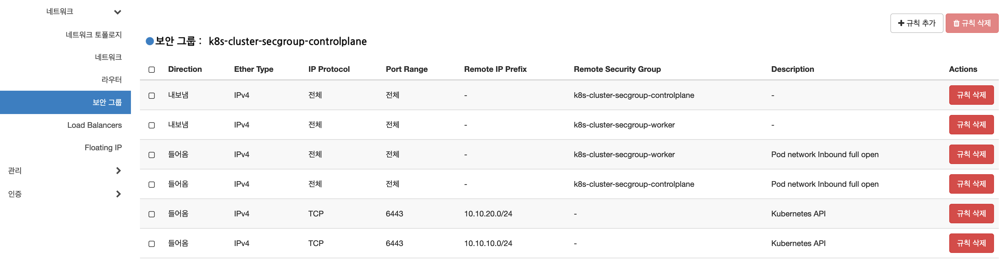

# Cluster API providers for AirGap Network

> [참고] https://github.com/kubernetes-sigs/cluster-api/tree/main/bootstrap/kubeadm


## Openstack 구성

- Project: edgecraft-close
- Network: closed-public

### Openstack AirGap Network 구성

- vxlan 외부네트워크를 생성한다. (closed-publc)

```sh
## step-1. 오픈스택 외부네트워크 추가
- 메뉴: 오픈스택대시보드 > 관리 > 네트워크 > 네트워크 > 네트워크 생성
- 설정:
이름: closed-public
프로젝트: edgecraft-close
공급자 네트워크 유형 > VXLAN
 구분 ID > 55555
외부 네트워크 > 체크

- subnet 설정:
Network Address: 10.10.20.0/24
```

- 보안그룹 생성
  - controlplane과 worker의 보안그룹은 inbound/outbound 모두 전체 프로토콜 열기로 한다. - pod간 network 모두 open (calico ReadinessProbe(9099) 체크 등으로 필요한 포트들이 있음)




## Private Management cluster 구성

- kore-on air-gap 설치 사용
- cluster api 설치 포함되어 있음

## Private registry 구성

- kore-on air-gap 설치 사용
- AirGap Network의 Workload Cluster에서 사용하기 위해서 네트워크를 공유함. - 10.10.10.0/24, 10.10.20.0/24

```sh
## step-1. Openstack Network 구성
## Openstack Instance 에서 네트워크 인터페이스를 추가 한다.
edgecrraft-close-registry	ubuntu-20.04 	closed-public 10.10.20.16
                                            edgecraft-close-net 10.10.10.16, 192.168.88.29
```

- harbor hostname을 도메인 사용으로 변경 한다.

```sh
## step-1. harbor를 domain 사용으로 설정변경
## 각 노드에서 도메인을 /etc/hosts에 추가 한다.
$ vi /etc/hosts
127.0.0.1 localhost
10.10.10.16 regi.edgecraft.acornsoft.io

## step-2. harbor domain 설정 적용
$ vi /var/lib/kore-on/harbor/harbor.yml
hostname: regi.edgecraft.acornsoft.io

## step-3. domain 인증서 추가
### openssl config file 수정
$ vi /var/lib/kore-on/cert/openssl.conf
[ req ]
distinguished_name = req_distinguished_name
[req_distinguished_name]

[ v3_ca ]
basicConstraints = critical, CA:TRUE
keyUsage = critical, digitalSignature, keyEncipherment, keyCertSign

[ v3_req_client ]
basicConstraints = CA:FALSE
keyUsage = critical, digitalSignature, keyEncipherment
extendedKeyUsage = clientAuth

[ v3_req_server ]
basicConstraints = CA:FALSE
keyUsage = critical, digitalSignature, keyEncipherment
extendedKeyUsage = serverAuth
subjectAltName = @alt_names_registry

[ alt_names_registry ]
DNS.1 = localhost
DNS.2 = edgecrraft-close-registry
DNS.3 = regi.edgecraft.acornsoft.io
IP.1 = 127.0.0.1
IP.2 = 10.10.10.16
IP.3 = 10.10.20.16

### root ca 인증서 변경
$ openssl req -x509 -new -nodes -key /var/lib/kore-on/cert/ca.key -days 36500 -out /data/harbor/cert/ca.crt -subj '/CN=harbor-ca' -extensions v3_ca -config /var/lib/kore-on/cert/openssl.conf

### harbor 인즌성 변경
$ openssl req -new -key /data/harbor/cert/harbor.key -subj '/CN=harbor' |       openssl x509 -req -CA /data/harbor/cert/ca.crt -CAkey /var/lib/kore-on/cert/ca.key -CAcreateserial -out /data/harbor/cert/harbor.crt -days 36500 -extensions v3_req_server -extfile /var/lib/kore-on/cert/openssl.conf

### harbor 변경된 인증서 적용
cp /data/harbor/cert/ca.crt /var/lib/kore-on/harbor/common/config/nginx/cert/ca.crt
cp /data/harbor/cert/harbor.key /data/harbor/secret/cert/server.key
cp /data/harbor/cert/harbor.crt /data/harbor/secret/cert/server.crt

## step-4. install 쉘을 실행하면 적용 된다.
$ /var/lib/kore-on/harbo/install.sh
```

- calico.yaml을 다운받을수 있도록 harvor nginx 서비스에 추가 한다.

```sh
## step-1. calico.yaml 파일 다운로드
$ mkdir -p /var/lib/kore-on/harbor/common/config/nginx/cert/download/calico/v3.25.1
$ curl -Lk https://raw.githubusercontent.com/projectcalico/calico/v3.25.1/manifests/calico.yaml -o /var/lib/kore-on/harbor/common/config/nginx/cert/download/calico/v3.25.1/calico.yaml

## step-2. nginx 설정 추가
$ /var/lib/kore-on/harbor/common/config/nginx/nginx.conf
http {
  ...
  server {
    ...

    location /download/calico/v3.25.1/calico.yaml {
      alias /etc/nginx/cert/download/calico/v3.25.1/calico.yaml;
    }
  }
}

## harbor nginx 재시작
$ cd /var/lib/kore-on/harbor
$ docker-compose exec -T proxy nginx -s reload
```

## ClusterAPI 구성 및 실행

### ClusterAPI 구성

- 사설 외부 네트워크 사용 설정

```sh
## step-1. 사설 외부 네트워크가 ID 값을 사용한다.
$ vi cluster-template-openstack.rc
...

OPENSTACK_EXTERNAL_NETWORK_ID="0b189d25-8b67-4c3b-96bb-dcff2ee7f931"


```

- private registry 설정 추가
```sh
## step-1. cluster-template-openstack.yaml 내용 추가
$ vi cluster-template-openstack.yaml
...

---
apiVersion: bootstrap.cluster.x-k8s.io/v1beta1
kind: KubeadmConfigTemplate
metadata:
  name: ${CLUSTER_NAME}-md-0
spec:
...
      preKubeadmCommands:
        - echo "10.10.20.16 regi.edgecraft.acornsoft.io" >> /etc/hosts
        - mkdir -p /etc/docker/certs.d/10.10.20.16
        - curl -Lk https://10.10.20.16/ca.crt -o /etc/docker/certs.d/10.10.20.16/ca.crt
        - rm -rf /etc/containerd/certs.d
        - mkdir -p /etc/containerd/certs.d/10.10.20.16
        - echo ${CONTAINERD_PRIVATE_REGISTY_HOSTS} | base64 -d > /etc/containerd/certs.d/10.10.20.16/hosts.toml
        - mkdir -p /etc/containerd/certs.d/docker.io
        - echo ${CONTAINERD_DOCKER_IO_HOSTS} | base64 -d > /etc/containerd/certs.d/docker.io/hosts.toml
        - mkdir -p /etc/containerd/certs.d/gcr.io
        - echo ${CONTAINERD_GCR_IO_HOSTS} | base64 -d > /etc/containerd/certs.d/gcr.io/hosts.toml
        - mkdir -p /etc/containerd/certs.d/ghcr.io
        - echo ${CONTAINERD_GHCR_IO_HOSTS} | base64 -d > /etc/containerd/certs.d/ghcr.io/hosts.toml
        - mkdir -p /etc/containerd/certs.d/quay.io
        - echo ${CONTAINERD_QUAY_IO_HOSTS} | base64 -d > /etc/containerd/certs.d/quay.io/hosts.toml
        - mkdir -p /etc/containerd/certs.d/registry.k8s.io
        - echo ${CONTAINERD_REGISTY_K8S_IO_HOSTS} | base64 -d > /etc/containerd/certs.d/registry.k8s.io/hosts.toml


---
apiVersion: controlplane.cluster.x-k8s.io/v1beta1
kind: KubeadmControlPlane
metadata:
  name: ${CLUSTER_NAME}-control-plane
spec:
...
    preKubeadmCommands:
      - echo "10.10.20.16 regi.edgecraft.acornsoft.io" >> /etc/hosts
      - mkdir -p /etc/docker/certs.d/10.10.20.16
      - curl -Lk https://10.10.20.16/ca.crt -o /etc/docker/certs.d/10.10.20.16/ca.crt
      - rm -rf /etc/containerd/certs.d
      - mkdir -p /etc/containerd/certs.d/10.10.20.16
      - echo ${CONTAINERD_PRIVATE_REGISTY_HOSTS} | base64 -d > /etc/containerd/certs.d/10.10.20.16/hosts.toml
      - mkdir -p /etc/containerd/certs.d/docker.io
      - echo ${CONTAINERD_DOCKER_IO_HOSTS} | base64 -d > /etc/containerd/certs.d/docker.io/hosts.toml
      - mkdir -p /etc/containerd/certs.d/gcr.io
      - echo ${CONTAINERD_GCR_IO_HOSTS} | base64 -d > /etc/containerd/certs.d/gcr.io/hosts.toml
      - mkdir -p /etc/containerd/certs.d/ghcr.io
      - echo ${CONTAINERD_GHCR_IO_HOSTS} | base64 -d > /etc/containerd/certs.d/ghcr.io/hosts.toml
      - mkdir -p /etc/containerd/certs.d/quay.io
      - echo ${CONTAINERD_QUAY_IO_HOSTS} | base64 -d > /etc/containerd/certs.d/quay.io/hosts.toml
      - mkdir -p /etc/containerd/certs.d/registry.k8s.io
      - echo ${CONTAINERD_REGISTY_K8S_IO_HOSTS} | base64 -d > /etc/containerd/certs.d/registry.k8s.io/hosts.toml
      - mkdir -p /etc/kubernetes/addon/calico
      - curl -Lk https://regi.edgecraft.acornsoft.io/download/calico/v3.25.1/calico.yaml > /etc/kubernetes/addon/calico/calico.yaml
```

- calico 설치를 위한 설정 적용

```sh
## step-1. cluster-template-openstack.yaml 내용 추가
$ vi cluster-template-openstack.yaml
...

---
apiVersion: controlplane.cluster.x-k8s.io/v1beta1
kind: KubeadmControlPlane
metadata:
  name: ${CLUSTER_NAME}-control-plane
spec:
...
    postKubeadmCommands:
      - kubectl --kubeconfig=/etc/kubernetes/admin.conf apply -f /etc/kubernetes/addon/calico/calico.yaml
```

- Openstack AirGap Network를 사용하기 위한 보안그룹 설정 추가

```sh
## step-1. cluster-template-openstack.yaml 내용 추가
### managedSecurityGroups: false - workloadcluster 노드의 k8s SecurityGroup 생성 여부
$ vi cluster-template-openstack.yaml
...

---
apiVersion: infrastructure.cluster.x-k8s.io/v1alpha6
kind: OpenStackCluster
metadata:
  name: ${CLUSTER_NAME}
spec:
  apiServerLoadBalancer:
    enabled: false
  cloudName: ${OPENSTACK_CLOUD}
  dnsNameservers:
  - ${OPENSTACK_DNS_NAMESERVERS}
  externalNetworkId: ${OPENSTACK_EXTERNAL_NETWORK_ID}
  identityRef:
    kind: Secret
    name: ${CLUSTER_NAME}-cloud-config
  managedSecurityGroups: false
  nodeCidr: ${OPENSTACK_NETWORK_CIDR}


### AirGap Network 사용을 위한 오픈스택에서 설정한 보안그룹 설정을 사용하도록 적용 한다.
### securityGroups: 항목에 controlplane, worker 가각의 보안그룹을 추가 한다.
---
apiVersion: infrastructure.cluster.x-k8s.io/v1alpha6
kind: OpenStackMachineTemplate
metadata:
  name: ${CLUSTER_NAME}-control-plane
spec:
  template:
    spec:
      securityGroups:
        - name: edgecraft-closed
        - name: k8s-cluster-secgroup-controlplane
      rootVolume:
        diskSize: ${OPENSTACK_ROOTVOLUME_DISKSIZE}
        volumeType: ${OPENSTACK_ROOTVOLUME_VOLUMETYPE}
        availabilityZone: ${OPENSTACK_ROOTVOLUME_AVAILABILITYZONE}
      cloudName: ${OPENSTACK_CLOUD}
      flavor: ${OPENSTACK_CONTROL_PLANE_MACHINE_FLAVOR}
      identityRef:
        kind: Secret
        name: ${CLUSTER_NAME}-cloud-config
      image: ${OPENSTACK_IMAGE_NAME}
      sshKeyName: ${OPENSTACK_SSH_KEY_NAME}
---
apiVersion: infrastructure.cluster.x-k8s.io/v1alpha6
kind: OpenStackMachineTemplate
metadata:
  name: ${CLUSTER_NAME}-md-0
spec:
  template:
    spec:
      securityGroups:
        - name: edgecraft-closed
        - name: k8s-cluster-secgroup-worker
      rootVolume:
        diskSize: ${OPENSTACK_ROOTVOLUME_DISKSIZE}
        volumeType: ${OPENSTACK_ROOTVOLUME_VOLUMETYPE}
        availabilityZone: ${OPENSTACK_ROOTVOLUME_AVAILABILITYZONE}
      cloudName: ${OPENSTACK_CLOUD}
      flavor: ${OPENSTACK_NODE_MACHINE_FLAVOR}
      identityRef:
        kind: Secret
        name: ${CLUSTER_NAME}-cloud-config
      image: ${OPENSTACK_IMAGE_NAME}
      sshKeyName: ${OPENSTACK_SSH_KEY_NAME}
```

### ClusterAPI Depoyments 설정

- 디렉토리 구조

```sh
## step-1. 디렉토리 구조
### The directory structure under the overrides directory should follow the template:
### <providerType-providerName>/<version>/<fileName>
# ├── bootstrap-kubeadm
# │   └── v1.1.5
# │       └── bootstrap-components.yaml
# ├── cluster-api
# │   └── v1.1.5
# │       └── core-components.yaml
# ├── control-plane-kubeadm
# │   └── v1.1.5
# │       └── control-plane-components.yaml
# └── infrastructure-aws
#     └── v0.5.0
#             ├── cluster-template-dev.yaml
#             └── infrastructure-components.yaml

### cert.manager
### 참고: https://github.com/cert-manager/cert-manager/releases/tag/v1.12.1
./deployments
  /cert-manager
    /v1.12.1
      cert.manager.yaml

### cluster-api core
### 참고: https://github.com/kubernetes-sigs/cluster-api/releases/tag/v1.4.3
./core
  /cluster-api
    /v1.4.3
      core-components.yaml
      metadata.yaml

### infrastructure - openstack
### 참고: https://github.com/kubernetes-sigs/cluster-api-provider-openstack/releases
./infrastructure
  /infrastructure-openstack
    /v0.7.3
      infrastructure-components.yaml
      metadata.yaml

### provider - kubeadm
### 참고: https://github.com/kubernetes-sigs/cluster-api/releases/tag/v1.4.3
./provider
  /bootstrap-kubeadm
    /v1.4.3
      bootstrap-components.yaml
      metadata.yaml
  /control-plane-kubeadm
    /v1.4.3
      control-plane-components.yaml
      metadata.yaml

```

- clusterctl Configuration File 설정

```sh
## step-1. clusterctl Configuration File 설정
$ vi clusterctl.yaml
---
providers:
  - name: "cluster-api"
    url: "/root/closed_network_capi_kubeadm_openstack_single/deployments/core/cluster-api/v1.4.3/core-components.yaml"
    type: "CoreProvider"
  - name: "kubeadm"
    url: "/root/closed_network_capi_kubeadm_openstack_single/deployments/provider/bootstrap-kubeadm/v1.4.3/bootstrap-components.yaml"
    type: "BootstrapProvider"
  - name: "kubeadm"
    url: "/root/closed_network_capi_kubeadm_openstack_single/deployments/provider/control-plane-kubeadm/v1.4.3/control-plane-components.yaml"
    type: "ControlPlaneProvider"
  - name: "openstack"
    url: "/root/closed_network_capi_kubeadm_openstack_single/deployments/infrastructure/infrastructure-openstack/v0.7.3/infrastructure-components.yaml"
    type: "InfrastructureProvider"

cert-manager:
  url: "/root/closed_network_capi_kubeadm_openstack_single/deployments/cert-manager/v1.12.1/cert-manager.yaml"
```


### 실행 - 쉘 스크립트 변경
```sh
## step-1. 쉘스크립트 수정
### Cluster API Openstack provider는 cluster명을 unique하게 사용해야 한다. (오픈스택설정들을 이름 으로 검색함 - router,network,subnet...)
$ vi 3.test-generate.sh
FILE_NAME="closed-kubeadm-provisioning"

## step-2. 쉘스크립트를 실행 노드에 복사
$ scp -i id_rsa closed_network_capi_kubeadm_openstack_single.tar.gz ubuntu@192.168.88.29:
```

### 실행 - 쉘 스크립트 역할

- 1.cluster-init.sh - cluster api deployments 쉘 스크립트
- 2.var-list.sh - 변수 선언 확인 쉘 스크립트
- 3.test-generate.sh - cluster api 템플릿 생성
- 4.test-create-cluster.sh - workload cluster 생성 쉘 스크립트
- 5.test-delete-cluster.sh - workload cluster 삭제 쉘 스크립트
- 6.test-get-kubeconfig.sh - workload cluster kubeconfig 가져오는 쉘 스크립트
- 7.test-monitoring-cluster.sh - workload cluster 생성 모니터링 쉘 스크립트 (생성 시간/상태)

```sh
## step-1. cluster api 템플릿 생성
$ ./3.test-generate.sh

## step-2. workload cluster 생성
$ ./4.test-create-cluster.sh
```

### 실행 - workload cluster 생성 단계 확인
```sh
## step-1. magement cluster에서 k8s crd 확인
$ watch "kubectl get machines.cluster.x-k8s.io --sort-by=.metadata.name | awk 'NR <= 101'"
```

### 실행 - 화면 

